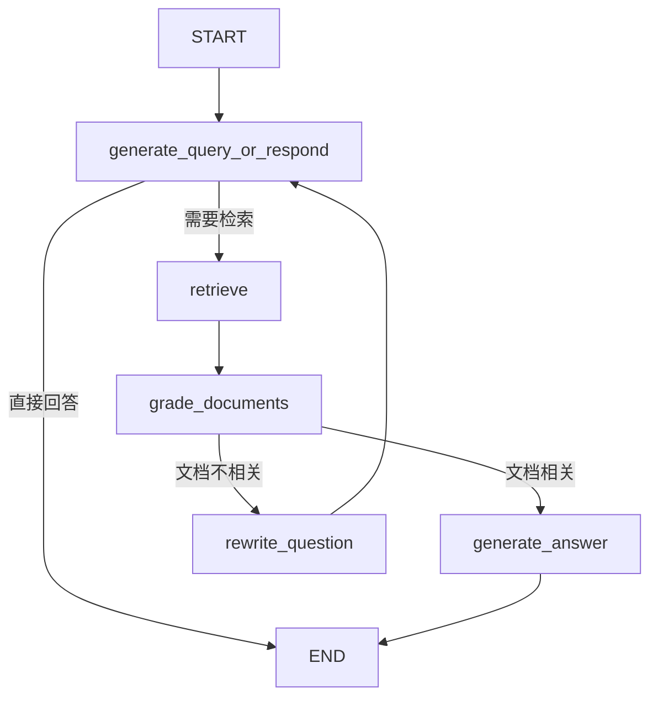

# Agentic RAG - 自定义 RAG Agent

## 概述

Agentic RAG（检索增强生成 Agent）是一个使用 LangGraph 构建的智能检索系统。与传统的 RAG 不同，Agentic RAG 能够自主决定是否需要检索信息、评估检索到的文档相关性，并在必要时重写查询以获得更好的结果。

### 应用场景

- **智能问答系统**：能够判断何时需要查询知识库
- **文档分析**：自动评估检索内容的相关性
- **研究助手**：通过查询重写获得更精准的信息

## 核心概念

### 什么是 Agentic RAG？

传统 RAG 系统通常对所有查询都进行检索，而 Agentic RAG 引入了智能决策机制：

1. **自主决策**：LLM 决定是否需要检索
2. **相关性评分**：自动评估检索文档的质量
3. **查询优化**：不相关时自动重写查询
4. **多轮检索**：支持迭代改进检索结果

### LangGraph 基础

#### 状态管理（State）
使用 `MessagesState` 管理对话历史和上下文，包含用户消息、助手回复、工具调用结果等。

#### 节点（Nodes）
- **generate_query_or_respond**：生成查询或直接回复
- **retrieve**：执行文档检索
- **grade_documents**：评估文档相关性
- **rewrite_question**：重写查询
- **generate_answer**：生成最终答案

#### 边（Edges）
- **无条件边**：节点间的直接连接
- **条件边**：根据节点输出动态路由（如 `tools_condition`）

## 依赖说明

本实例需要以下依赖包（已配置在项目根目录的 pyproject.toml 中）：

### 主要依赖
- **langchain** (>=0.3.18): LLM 调用和工具管理
- **langgraph** (>=0.2.62): 构建 Agent 图结构
- **langchain-openai**: OpenAI 模型集成
- **langchain-community**: 文档加载器等社区工具
- **langchain-text-splitters**: 文档分割工具
- **beautifulsoup4**: 网页内容解析

### 安装方式

```bash
# 在项目根目录运行
uv sync
```

## Agent 架构设计

### 状态定义

使用 LangGraph 内置的 `MessagesState`：

```python
from langgraph.graph import MessagesState

# MessagesState 包含:
# - messages: List[BaseMessage] - 消息历史列表
```

### 节点说明

#### 1. generate_query_or_respond
**功能**：决定是检索还是直接回复
- 输入：用户问题
- 输出：工具调用（检索）或直接答案
- 逻辑：使用 LLM 判断是否需要查询知识库

#### 2. retrieve (ToolNode)
**功能**：执行文档检索
- 输入：检索查询
- 输出：检索到的文档内容
- 逻辑：调用向量数据库进行语义搜索

#### 3. grade_documents
**功能**：评估文档相关性
- 输入：检索到的文档和原始问题
- 输出：路由决策（生成答案 or 重写查询）
- 逻辑：使用结构化输出判断文档是否相关

#### 4. rewrite_question
**功能**：优化查询语句
- 输入：原始问题
- 输出：改进后的查询
- 逻辑：LLM 重新表述问题以提高检索效果

#### 5. generate_answer
**功能**：基于检索内容生成答案
- 输入：原始问题和检索上下文
- 输出：最终答案
- 逻辑：使用上下文生成准确简洁的回答

### 工作流程

```
START
  ↓
generate_query_or_respond
  ↓
[条件分支: tools_condition]
  ├→ 需要检索 → retrieve
  │              ↓
  │          grade_documents
  │              ↓
  │         [条件分支]
  │           ├→ 相关 → generate_answer → END
  │           └→ 不相关 → rewrite_question → generate_query_or_respond
  │
  └→ 直接回答 → END
```

### 流程图示



## 配置说明

### 环境变量设置

```bash
# .env 文件
OPENAI_API_KEY=your_openai_api_key_here
```

### 文档来源配置

示例代码中使用网页作为文档源，你可以修改为：

```python
# 方案 1: 本地文档
from langchain_community.document_loaders import TextLoader
docs = TextLoader("your_file.txt").load()

# 方案 2: PDF 文档
from langchain_community.document_loaders import PyPDFLoader
docs = PyPDFLoader("your_file.pdf").load()

# 方案 3: 多个网页
from langchain_community.document_loaders import WebBaseLoader
urls = ["url1", "url2", "url3"]
docs = [WebBaseLoader(url).load() for url in urls]
```

### 向量数据库配置

示例使用内存向量库，生产环境可改为持久化存储：

```python
# 使用 Chroma（持久化）
from langchain_community.vectorstores import Chroma

vectorstore = Chroma.from_documents(
    documents=doc_splits,
    embedding=OpenAIEmbeddings(),
    persist_directory="./chroma_db"
)
```

## 使用示例

### 基本使用

```python
from langgraph.graph import StateGraph, MessagesState

# 1. 构建图
workflow = StateGraph(MessagesState)
workflow.add_node(generate_query_or_respond)
workflow.add_node("retrieve", ToolNode([retriever_tool]))
# ... 添加其他节点和边
graph = workflow.compile()

# 2. 运行查询
result = graph.invoke({
    "messages": [
        {"role": "user", "content": "什么是奖励黑客攻击的类型？"}
    ]
})

# 3. 获取结果
print(result["messages"][-1].content)
```

### 流式输出

```python
for chunk in graph.stream({
    "messages": [{"role": "user", "content": "你的问题"}]
}):
    for node, update in chunk.items():
        print(f"节点: {node}")
        print(update["messages"][-1].content)
```

## 运行说明

### 1. 安装依赖

```bash
cd 项目根目录
uv sync
```

### 2. 设置环境变量

```bash
# Windows
set OPENAI_API_KEY=your_key

# Linux/Mac
export OPENAI_API_KEY=your_key
```

### 3. 运行示例

```bash
python agent/agentic_rag/agentic_rag_example.py
```

### 预期输出

```
节点: generate_query_or_respond
工具调用: retrieve_blog_posts(query="types of reward hacking")

节点: retrieve
[检索到的文档内容]

节点: generate_answer
Lilian Weng 将奖励黑客攻击分为两类：环境或目标错误规范，以及奖励篡改...
```

## 核心代码片段

### 1. 创建检索工具

```python
from langchain.tools import tool

@tool
def retrieve_blog_posts(query: str) -> str:
    """搜索并返回相关文档内容"""
    docs = retriever.invoke(query)
    return "\n\n".join([doc.page_content for doc in docs])
```

### 2. 文档相关性评分

```python
from pydantic import BaseModel, Field

class GradeDocuments(BaseModel):
    binary_score: str = Field(
        description="相关性评分: 'yes' 表示相关, 'no' 表示不相关"
    )

def grade_documents(state: MessagesState) -> Literal["generate_answer", "rewrite_question"]:
    question = state["messages"][0].content
    context = state["messages"][-1].content
    
    response = grader_model.with_structured_output(GradeDocuments).invoke([...])
    
    if response.binary_score == "yes":
        return "generate_answer"
    else:
        return "rewrite_question"
```

### 3. 查询重写

```python
def rewrite_question(state: MessagesState):
    """重写原始问题以提高检索效果"""
    question = state["messages"][0].content
    prompt = f"根据以下问题，重新表述以获得更好的搜索结果：\n{question}"
    response = response_model.invoke([{"role": "user", "content": prompt}])
    return {"messages": [HumanMessage(content=response.content)]}
```

## 进阶功能

### 1. 多轮检索

可以添加最大重试次数限制：

```python
class EnhancedState(MessagesState):
    retry_count: int = 0
    max_retries: int = 3

def grade_documents(state: EnhancedState):
    if state["retry_count"] >= state["max_retries"]:
        return "generate_answer"  # 达到上限直接生成答案
    # ... 评分逻辑
```

### 2. 混合检索

结合关键词和语义搜索：

```python
from langchain.retrievers import EnsembleRetriever
from langchain_community.retrievers import BM25Retriever

# BM25 关键词检索
bm25_retriever = BM25Retriever.from_documents(documents)
# 语义检索
vector_retriever = vectorstore.as_retriever()

# 混合检索
ensemble_retriever = EnsembleRetriever(
    retrievers=[bm25_retriever, vector_retriever],
    weights=[0.5, 0.5]
)
```

### 3. 添加元数据过滤

```python
# 在检索时过滤特定元数据
retriever = vectorstore.as_retriever(
    search_kwargs={
        "k": 4,
        "filter": {"source": "blog", "year": 2024}
    }
)
```

## 性能优化建议

1. **批量处理**：批量索引文档以提高速度
2. **缓存机制**：缓存常见查询结果
3. **并行检索**：对多个查询源并行检索
4. **索引优化**：使用合适的 chunk_size 和 chunk_overlap

## 常见问题

### Q: 如何调整文档分块大小？

```python
text_splitter = RecursiveCharacterTextSplitter.from_tiktoken_encoder(
    chunk_size=100,    # 调整这个值
    chunk_overlap=50   # 调整重叠部分
)
```

### Q: 如何使用其他 LLM？

```python
from langchain.chat_models import init_chat_model

# 使用 Qwen
response_model = init_chat_model("qwen/qwen-max", temperature=0)

# 使用 Claude
response_model = init_chat_model("anthropic/claude-3-sonnet", temperature=0)
```

### Q: 如何可视化图结构？

```python
from IPython.display import Image, display

# 生成图的可视化
display(Image(graph.get_graph().draw_mermaid_png()))
```

## 参考资料

### 官方文档
- [LangGraph Agentic RAG 教程](https://docs.langchain.com/oss/python/langgraph/agentic-rag)
- [LangGraph 文档](https://langchain-ai.github.io/langgraph/)
- [LangChain RAG 指南](https://python.langchain.com/docs/use_cases/question_answering/)

### 相关概念
- [RAG (Retrieval-Augmented Generation)](https://arxiv.org/abs/2005.11401)
- [向量数据库基础](https://python.langchain.com/docs/modules/data_connection/vectorstores/)
- [文档分割策略](https://python.langchain.com/docs/modules/data_connection/document_transformers/)

### 扩展阅读
- [高级 RAG 技术](https://blog.langchain.dev/deconstructing-rag/)
- [Agent 设计模式](https://langchain-ai.github.io/langgraph/concepts/)

---

**版本**：v1.0  
**最后更新**：2026-01-12  
**作者**：项目团队
