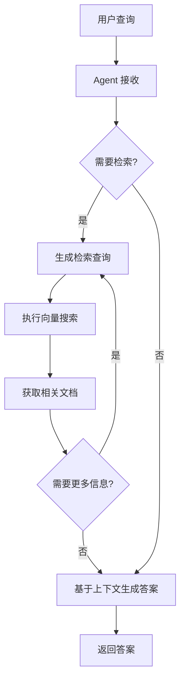
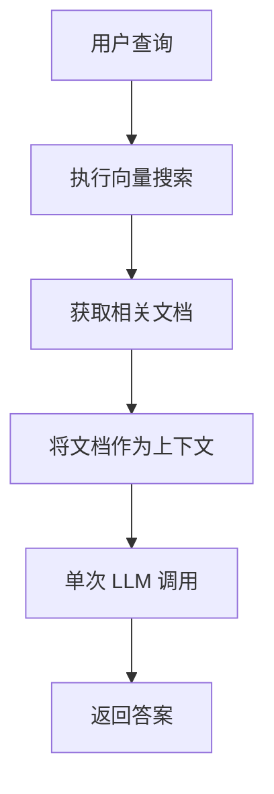

# RAG Agent 教程

> 基于 LangChain 官方文档：[Build a RAG agent with LangChain](https://docs.langchain.com/oss/python/langchain/rag)

## 目录

- [什么是 RAG Agent](#什么是-rag-agent)
- [核心概念](#核心概念)
- [RAG Agent vs RAG Chain](#rag-agent-vs-rag-chain)
- [工作流程](#工作流程)
- [实现方式](#实现方式)
- [使用场景](#使用场景)
- [快速开始](#快速开始)

## 什么是 RAG Agent

RAG（Retrieval Augmented Generation，检索增强生成）Agent 是一种智能问答系统，它结合了：

- **检索（Retrieval）**：从知识库中搜索相关信息
- **生成（Generation）**：使用 LLM 基于检索到的信息生成答案
- **Agent（代理）**：LLM 可以自主决策是否需要检索、检索什么内容

## 核心概念

### 1. 索引（Indexing）

索引是一个独立的数据准备流程，通常在应用启动前完成：

```
文档加载 → 文档分割 → 向量化 → 存储到向量数据库
```

**关键步骤：**
- **文档加载器**：从各种数据源（PDF、网页、数据库等）加载文档
- **文本分割器**：将长文档分割成小块（chunks），便于检索
- **嵌入模型**：将文本转换为向量表示
- **向量存储**：存储向量和原始文本，支持相似度搜索

### 2. 检索与生成（Retrieval and Generation）

这是 RAG 的核心运行时流程：

```
用户查询 → Agent 决策 → 检索工具 → 获取上下文 → LLM 生成答案
```

**关键特点：**
- **自主决策**：Agent 可以决定是否需要检索
- **上下文感知**：Agent 可以基于对话历史生成更好的检索查询
- **多次检索**：Agent 可以执行多次检索来回答复杂问题

## RAG Agent vs RAG Chain

LangChain 提供了两种 RAG 实现方式，各有优劣：

### RAG Agent（推荐用于复杂场景）

**优势：**
- ✅ **按需检索**：只在需要时才执行检索，不会对简单问候或后续问题进行不必要的检索
- ✅ **上下文感知查询**：LLM 可以结合对话上下文生成更好的检索查询
- ✅ **多次检索**：可以执行多次检索来支持复杂的用户查询

**劣势：**
- ⚠️ **两次推理调用**：需要一次调用生成查询，另一次生成最终答案
- ⚠️ **控制力降低**：LLM 可能在需要检索时跳过，或执行不必要的检索

**适用场景：**
- 多轮对话应用
- 需要复杂推理的 Q&A
- 问题类型多样化

### RAG Chain（推荐用于简单场景）

**优势：**
- ✅ **单次推理**：每个查询只需一次 LLM 调用
- ✅ **低延迟**：更快的响应速度
- ✅ **可预测**：总是执行检索，行为一致

**劣势：**
- ⚠️ **总是检索**：即使对简单问题也会执行检索
- ⚠️ **缺乏灵活性**：不能执行多次检索或跳过检索

**适用场景：**
- 简单的文档问答
- 每个查询都需要检索的场景
- 对延迟要求严格的应用

## 工作流程

### RAG Agent 工作流程



**示例对话流程：**

```
用户: "什么是任务分解的标准方法？找到答案后，查找该方法的常见扩展。"

Agent 思考: 这需要两步：
1. 首先查询 "任务分解的标准方法"
2. 然后查询找到的方法的扩展

[第一次检索]
检索查询: "任务分解的标准方法"
检索结果: "Chain of Thought (CoT) 是常用的标准方法..."

[第二次检索]
检索查询: "Chain of Thought 方法的扩展"
检索结果: "常见扩展包括 Tree of Thoughts, ReAct..."

[生成最终答案]
"任务分解的标准方法是 Chain of Thought (CoT)，常见扩展包括..."
```

### RAG Chain 工作流程



## 实现方式

### 1. RAG Agent 实现

```python
from langchain.agents import create_agent, tool
from langchain_core.documents import Document

# 创建检索工具
@tool(response_format="content_and_artifact")
def retrieve_context(query: str):
    """检索信息以帮助回答查询"""
    retrieved_docs = vector_store.similarity_search(query, k=2)
    serialized = "\n\n".join(
        f"来源: {doc.metadata}\n内容: {doc.page_content}"
        for doc in retrieved_docs
    )
    return serialized, retrieved_docs

# 创建 Agent
tools = [retrieve_context]
prompt = "你可以使用检索工具从知识库中获取上下文信息。"
agent = create_agent(model, tools, system_prompt=prompt)

# 使用 Agent
for step in agent.stream(
    {"messages": [{"role": "user", "content": "你的问题"}]},
    stream_mode="values",
):
    step["messages"][-1].pretty_print()
```

### 2. RAG Chain 实现

```python
from langchain.agents.middleware import dynamic_prompt, ModelRequest

@dynamic_prompt
def prompt_with_context(request: ModelRequest) -> str:
    """将检索到的上下文注入提示"""
    last_query = request.state["messages"][-1].text
    retrieved_docs = vector_store.similarity_search(last_query)
    
    docs_content = "\n\n".join(doc.page_content for doc in retrieved_docs)
    
    return (
        "你是一个有用的助手。使用以下上下文回答问题："
        f"\n\n{docs_content}"
    )

agent = create_agent(model, tools=[], middleware=[prompt_with_context])
```

## 使用场景

### RAG Agent 适用场景

1. **客服机器人**
   - 可以处理问候、闲聊
   - 需要时查询知识库
   - 支持多轮对话

2. **技术文档助手**
   - 复杂技术问题需要多次查询
   - 需要综合多个文档片段
   - 上下文理解很重要

3. **研究助手**
   - 需要深度探索主题
   - 多步骤推理
   - 动态调整检索策略

### RAG Chain 适用场景

1. **简单 Q&A**
   - 每个问题都需要查询文档
   - 问题相对独立
   - 追求低延迟

2. **内容总结**
   - 总是需要检索原文
   - 不需要多次检索
   - 处理流程固定

3. **事实查询**
   - 明确的查询意图
   - 直接的答案需求
   - 不需要复杂推理

## 技术对比

| 特性 | RAG Agent | RAG Chain |
|------|-----------|-----------|
| LLM 调用次数 | 2+ 次 | 1 次 |
| 响应延迟 | 较高 | 较低 |
| 灵活性 | 高 | 低 |
| 控制精度 | 中等 | 高 |
| 多次检索 | ✅ 支持 | ❌ 不支持 |
| 对话感知 | ✅ 强 | ❌ 弱 |
| 适合复杂查询 | ✅ 是 | ❌ 否 |
| 适合简单查询 | ⚠️ 可以但慢 | ✅ 是 |

## 快速开始

### 前置要求

```bash
# 安装依赖
uv pip install langchain langchain-community langchain-chroma
uv pip install langchain-text-splitters bs4
uv pip install dashscope  # 使用 Qwen 嵌入模型
uv pip install python-dotenv
```

### 环境配置

创建 `.env` 文件：

```env
# Qwen API 密钥（用于嵌入和聊天）
QWEN_API_KEY=your_api_key_here

# 嵌入模型（可选，默认使用 text-embedding-v1）
QWEN_EMBEDDING_MODEL=text-embedding-v1

# 聊天模型（可选，默认使用 qwen-max）
QWEN_CHAT_MODEL=qwen-max

# LangSmith 追踪（可选）
LANGSMITH_TRACING=true
LANGSMITH_API_KEY=your_langsmith_key
```

### 运行示例

```bash
# 进入 rag_agent 目录
cd rag/rag_agent

# 运行 RAG Agent 示例
uv run rag_agent_example.py
```

## 最佳实践

### 1. 文档准备

- **合适的块大小**：通常 500-1000 个字符
- **块重叠**：200 个字符的重叠保持上下文连续性
- **元数据**：保留来源、页码等信息便于追溯

### 2. 检索优化

- **返回数量（k）**：通常 2-4 个文档片段
- **相似度阈值**：过滤不相关的结果
- **重排序**：使用更强大的模型重新排序结果

### 3. Agent 提示

- **明确工具用途**：告诉 Agent 何时使用检索工具
- **示例驱动**：提供好的使用示例
- **约束条件**：设置必要的限制（如检索次数）

### 4. 性能优化

- **缓存**：缓存常见查询结果
- **批处理**：批量处理嵌入向量
- **异步**：使用异步 API 提高吞吐量

## 进阶主题

### 1. 混合检索

结合多种检索方法：
- **稠密检索**：向量相似度搜索
- **稀疏检索**：关键词匹配（BM25）
- **语义重排序**：使用 Cross-Encoder 重排

### 2. 查询重写

改进检索效果：
- **查询扩展**：添加同义词、相关术语
- **查询分解**：将复杂查询拆分为多个简单查询
- **假设性文档嵌入（HyDE）**：生成假设答案来改进检索

### 3. 文档评分

评估检索质量：
- **相关性评分**：LLM 评估文档是否相关
- **自我查询**：从查询中提取过滤条件
- **主动检索**：动态决定是否需要更多文档

### 4. 多源 RAG

从多个来源检索：
- **多个向量存储**：不同类型的文档
- **结构化 + 非结构化**：结合数据库和文档
- **实时数据**：结合 API 调用

## 常见问题

### Q: RAG Agent 响应很慢怎么办？

**解决方案：**
1. 使用更快的嵌入模型
2. 减少检索文档数量（k）
3. 考虑使用 RAG Chain 代替
4. 启用缓存

### Q: Agent 不执行检索怎么办？

**解决方案：**
1. 改进 system prompt，明确说明何时使用工具
2. 提供使用示例（few-shot）
3. 使用更强的 LLM 模型
4. 考虑使用 RAG Chain 强制检索

### Q: 检索到的文档不相关怎么办？

**解决方案：**
1. 优化文档分割策略
2. 改进嵌入模型
3. 增加相似度阈值
4. 实现查询重写
5. 添加文档评分步骤

### Q: 如何支持多语言？

**解决方案：**
1. 使用多语言嵌入模型
2. 统一语言（翻译查询或文档）
3. 为每种语言维护独立的向量存储

## 更多资源

- [LangChain 官方文档](https://docs.langchain.com/)
- [LangChain RAG 教程](https://docs.langchain.com/oss/python/langchain/rag)
- [LangGraph Agentic RAG](https://langchain-ai.github.io/langgraph/tutorials/rag/langgraph_agentic_rag/)
- [语义搜索教程](../semantic_search/README.md)
- [LangSmith 可观测性](../langsmith_observability/langsmith_observability_quickstart.md)

## 下一步

完成本教程后，你可以：

1. ✅ 尝试运行 `rag_agent_example.py`
2. ✅ 使用自己的文档建立知识库
3. ✅ 实验 RAG Agent 和 RAG Chain 的性能差异
4. ✅ 添加对话记忆以支持多轮对话
5. ✅ 集成到实际应用中
6. ✅ 使用 LangSmith 追踪和优化性能

## 总结

RAG Agent 是构建智能 Q&A 系统的强大方法，它结合了信息检索和大语言模型的优势。选择 RAG Agent 还是 RAG Chain 取决于你的具体需求：

- **复杂对话、多步推理** → RAG Agent
- **简单查询、低延迟要求** → RAG Chain

无论选择哪种方式，LangChain 都提供了简单易用的 API 来快速实现和部署你的 RAG 应用！
